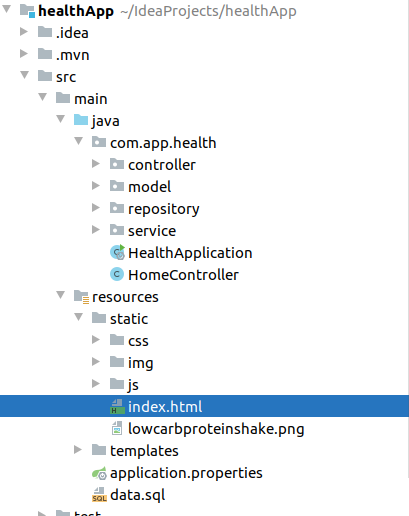
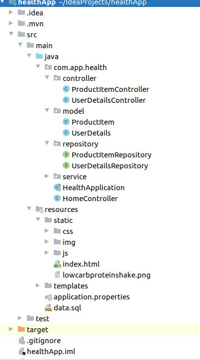

# Health Web Application:

## Introduction

As more and more people are getting into technology, it has certainly increased the dependency on the digital equipments such as Mobile phones, Tablets, laptops etc.. Now a days, people even do socializing over the internet. Online tutorials are made to help students learn from their home. Another major benefit of this digitization is that people tend to shop online and therefore today there are large number of E-commerce companies such as amazon.com who have established their businesses online. People like to order their products online and get it delivered at their door steps which saves their time and effort. Due to such a high demand, these online e-commerce companies make attractive websites and mobile applications to help the users to browse through their products and order them online conveniently. Therefore I have developed a web application to understand the functioning of the e-commerce application as an IT administrator.

## Description of the functionality

I have developed a online web application for a health company as a demo to show the working of the online e-commerce application. Our web application is built by leveraging various existing technologies which as described in this section as below:

### 1.  Springboot-starter-web

I used springboot for our project as it provides fast development of application which can be simple or web-based. It is comparitively easier and takes less time in configuring and building the applications. The springboot leverages the Spring framework. It provides the software developers the functionalities of spring framework and web servers combined in one single module. Springboot also provides several other useful features such as effective database transactions, integration with Java APIs and simultaneously reduces the time of development.

### 2. H2 Database engine

H2 database engine is an open source, fast, reliable JDBC API. It has builtin servers and database modes such as in-memory database. The H2 database engine also provides browser based application for the console for easy access and also removes any binding or mapping complexities that occurs while using other databases. Also, the main feature is that it is comparitively very lightweight.

### 3. Javascript/CSS/HTML

In our application I used three languages for our web pages. All the languages mentioned have their own functionality and work side by side to enhace the working of our online health application.
I used HTML to put the contents in our web-pages such as login,registration forms and product details.
In order to effectively display the contents specified in the HTML, I used CSS.
At the end, to attach the functionalities to these web pages, I used Java script. The Javascript manages all the functioning of the web-pages such as generating cart, adding products to cart, updating stock etc.

### 4. Maven

For effective project management I used maven. It helps in building the Java project by loading the libraries, packages from the repositories and thereby providing the existing functionalities into our java project. It makes the process of building projects easy and helps in maintaining the uniformity across the build system.

## Use Cases of Health Application

The main purpose of making a online health application is to understand the detailed functionality behind an online e-commerce website which I use in our daily life. The demo web application I developed has certain functionality which resembles with an existing e-commerce web application.

1. The health application can be used by a medical story or a pharmacy to put their business online.
2. They can sell products to customers who are looking to buy health products online.
3. This online service by the pharmacy will help the patients who are seriously ill and cannot go out to buy medicines.
4. The online selling of products will certainly ensure security on the bills as it can avoid any kind of theft or scam from the workers.
5. It will also help the administrator of the pharmacy to easily update the stocks on the portal using the special "admin" rights which makes it secure.
6. In this portal, any number of the customers can register their accounts simulataneously using the registration page.
7. This web application provide the flexibility to the customers to use either of payment methods such as cash on delivery(COD), net-banking or even by credit/debit cards.
8. Another important use case is that it allows guest login and therefore all the customers do not need to login
   

## Screenshots of the Health Application

 In this section, some screenshots are attached below to show the working of the application and also to understand the above mentioned use cases.
 
 ### Screenshot -1
 The first screenshot depicts the first page of our application. In this screenshot we can see there are two options for the customer to login or register itself and to continue as a guest.

### Screenshot -2

 This screenshot shows the registeration form and the dialog box to show the successfull registeration of the customer.
 

### Screenshot -3

This screenshot shows the homepage of our application. It shows all the products that are currently available to the customers. This page contains various functionalities such as AddToCart, RemoveFromCart, ,ViewCart, Checkout etc..

### Screenshot -4

It shows the products that are added in cart to the customers along with the total price and their quantities. It shows the price of each product as well. The cart is displayed when the customers selects view cart option on the top left side.

### Screenshot -5

This image shows the admin page when the administrator of the application logins using the admin credentials. This page gives the admin to update the stocks.

### Screenshot -6

This screenshot shows the final page of our application which is displayed when the user selects the checkout option. It is displayed as an confirmation that the order has been placed successfully.

## Database Structure

Now a days there are many databases that are available for free but are complex to use and requires good technical skills to setup. They also lack the portability option as they have to be binded again and again when moving the application from one system to another system. Generally, they include certain steps for their functioning such as: installation, schema setup, designing tables, inserting data and then finally connecting it to the application which again requires lots of code.

However it highly depends on the scenario to opt a particular among other available databases. 
For our case, there was a high chance that our application needs to transferred from our system to another using the github repository, therefore we used in-memory database which makes it highly easier by avoiding any binding required in other databases.

This database requires minimal project setup and configuration.

Among the in-memory databases, we used H2. It is a RDBMS which is also written in java and supports the client-server architecture.

To connect to spring boot, we require a dependency to be added in pom.xml among various dependencies.

Another major advantage of using this database is that it lives only for the time, our application is in execution.
There is also a web interface known as H2-console to see the entire database created and all the data in it. It is protected by credentials which we can set up using the console.

## Pattern used

In our application I used several design patterns that reduced the complexity involved in our web application and simultaneously provide a standard for development.

### 1.  MVC
I used MVC which is one of the widely adopted pattern specially for these kind of applications.
MVC stands for Model, View and Controller. This pattern divides the mechanism into three parts that are as follows:

### Model
This part of the pattern is responsible for defining the logic of the project and represents the java object.

### View
It is responsible for providing the interface between the application users and the applications. In this part, I put all the HTML files that are required to display forms such as login and registeration.

### Controller
The controller is use to provide the flow to our project. It is responsible to update the view part whenever necessary.

## Implementation of the pattern used in Health Web Application

The below picture explains the project structure of our code. In this picture we can see, there are 4 packages under com.app.health.

While writing the code, I have tried to seperate the functionality of each module as much as possible. This allows us to modify the code at any given time without much overhead. 

The four packages provide unique functionality to our application. In the below screenshot, we can the see the expanded packages of our project.

### Controller package

The controller package of the application contains two java classes. To seperate the functionality, I defined two classes for users and products respectively. User class mapped to users API whereas the product class is mapped to product API. The two class are resposible for defining the services. 

### Model package

In the application, a model package was built containing 2 java classes, one for product and another one for the users. Both the java classes have defined constructors with their getters and setter for the user and product values.

### Repository

Since our application also contains database functionality, I tried to seperate it's code with other functionalities. The repository package contains interfaces for product Items and user Details. They both extends CrudRepository to enable the "CRUD" functionality in our application

### Service

In the servie package, I specified two class HealthApplication and HomeController. HealthApplication is our main application which will be executed and I haven't put any function definition, declaration, class , variables etc.. in our main class. The HomeController class defines all the mapping of the webpages.

### View

In the static package of our project, I can see there are 3 more packages namely; css, img and js. These 3 packages are responsible for the visualization of our code. CSS contains predefined style sheets which I used in our project to give a proper look and feel. The "img" package contains all the images of our products that I used in our application and displayed them on the webpage.

### Templates 
Lastly in the templates package, there are two files namely; application.properties and data.sql. Application.properties as the name suggests defines all the properties related to the application such as caching, dataasource url, drivers etc.. and data.sql contains all the sql queries that I requried in our application.

### 2. Singleton Pattern

A singleton pattern is a pattern in which only single instance of a class is present in the JVM. If we look at our main class can be instatiated only once and that will be running our web application. At any given time, there can only be one instance of our class running.

### 3. Adapter Pattern

An adapter pattern is that pattern where two interfaces that are completely un related to each other in terms of the functionality they provide are clubbed together to achieve a single objective. In our application, we defined two interfaces as explained above that for users and products. These two interfaces are joined together using a single object to provide the overall functionality of maintaining the database for the users and product items in our web application.

### 4. Chain of Responsibility Pattern

In this pattern, the main goal is to achieve the loose couple to a maximum extent. The user command is passed through all the sub-parts of the program and each parts seperately plays a role in processing the command. In our application also, I defined multiple packages each with their specific set of roles. These packages simultaneously process the commands and generate a common output. 

## Reference 

1. Pattern study : https://www.journaldev.com/1827/java-design-patterns-example-tutorial

2. MVC Pattern : https://www.geeksforgeeks.org/mvc-design-pattern/
3. Spring Boot : https://spring.io/projects/spring-boot
4. In memory database : https://www.omnisci.com/technical-glossary/in-memory-database
5. H2 database : https://www.h2database.com/html/main.html
6. Javascript, CSS and HTML : https://www.w3schools.com/howto/default_page5.asp
   